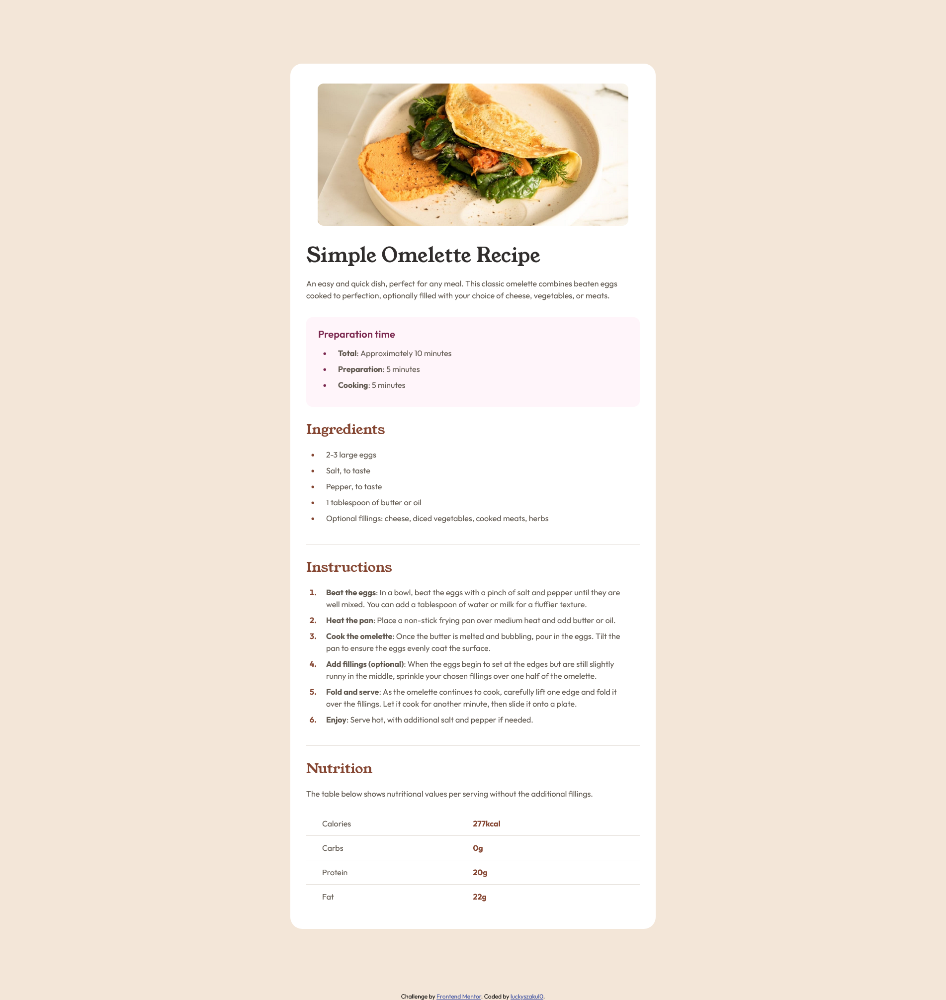

# Frontend Mentor - Recipe page solution

This is a solution to the [Recipe page challenge on Frontend Mentor](https://www.frontendmentor.io/challenges/recipe-page-KiTsR8QQKm). Frontend Mentor challenges help you improve your coding skills by building realistic projects. 

## Table of contents

- [Frontend Mentor - Recipe page solution](#frontend-mentor---recipe-page-solution)
  - [Table of contents](#table-of-contents)
  - [Overview](#overview)
    - [Screenshot](#screenshot)
    - [Links](#links)
  - [My process](#my-process)
    - [Built with](#built-with)
    - [What I learned](#what-i-learned)
    - [Useful resources](#useful-resources)
  - [Author](#author)

## Overview

### Screenshot



### Links

- Solution URL: [Frontend Mentor Solution](https://www.frontendmentor.io/solutions/mobile-first-recipe-page-made-with-scss-Ku9FfmY9yg)
- Live Site URL: [Github Pages](https://luckyszakul0.github.io/FM-Recipe-page/)

## My process

### Built with

- Semantic HTML5 markup
- SCSS
- Flexbox
- CSS Grid
- Mobile-first workflow
- Figma file

### What I learned

I think the only new thing I learned in this challenge is styling the bullets and numbers in ordered and unordered lists in CSS

```CSS
li::marker{
  color: $brown800;
}
```

### Useful resources

- [CSS Reset](https://www.joshwcomeau.com/css/custom-css-reset/) - Very useful CSS Reset.

## Author

- Github - [luckyszakul0](https://github.com/luckyszakul0)
- Frontend Mentor - [@luckyszakul0](https://www.frontendmentor.io/profile/luckyszakul0)